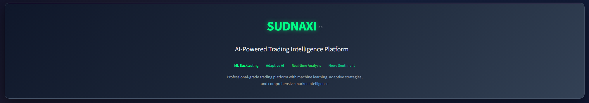
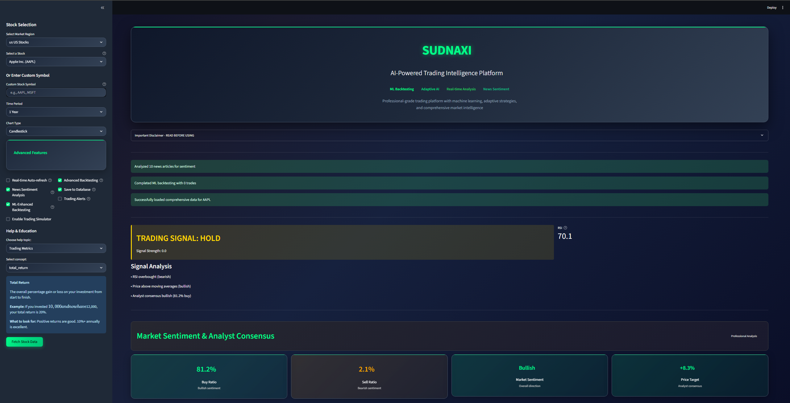
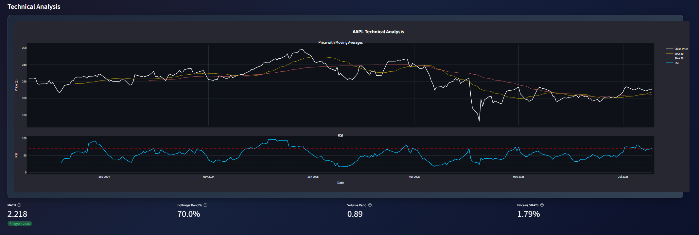
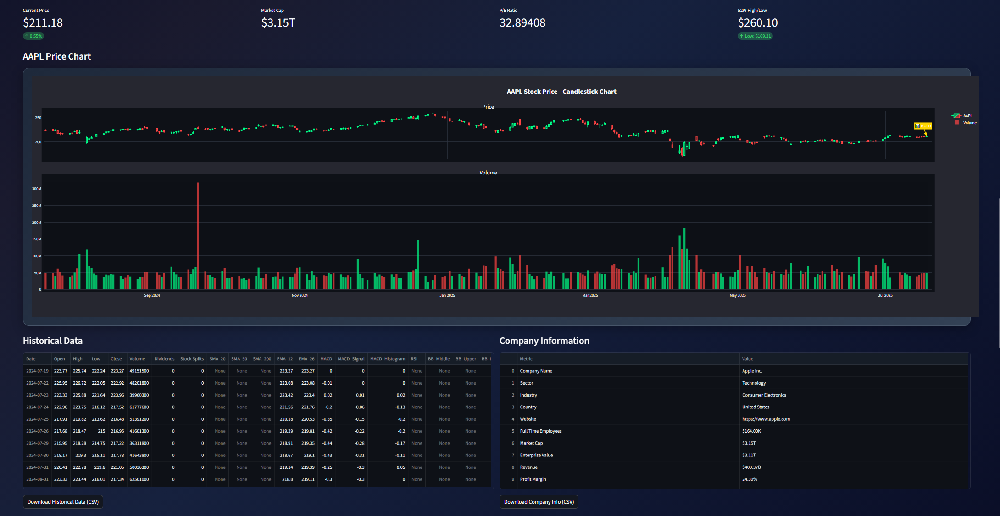
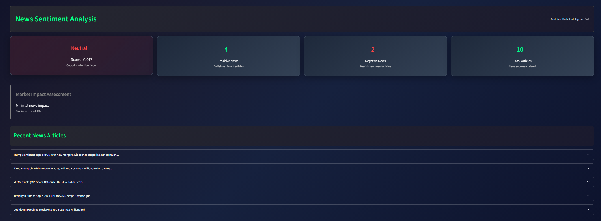
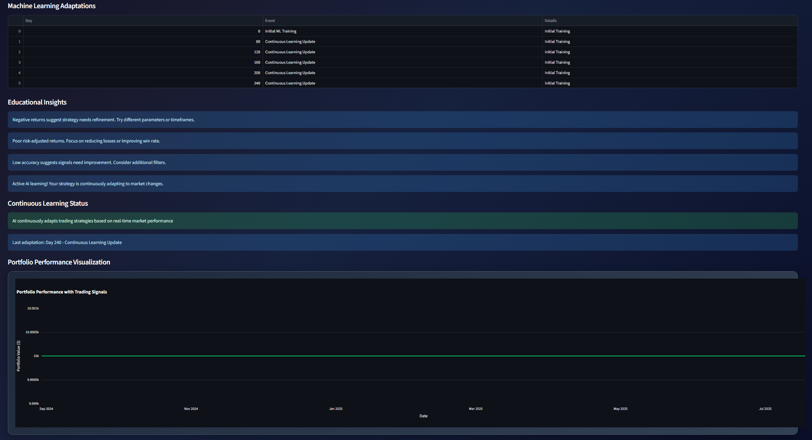
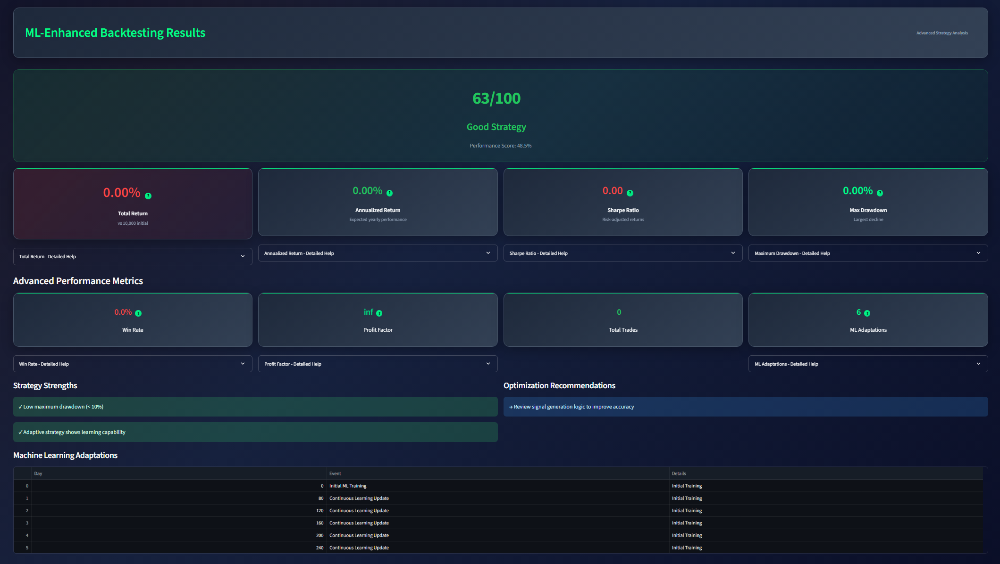
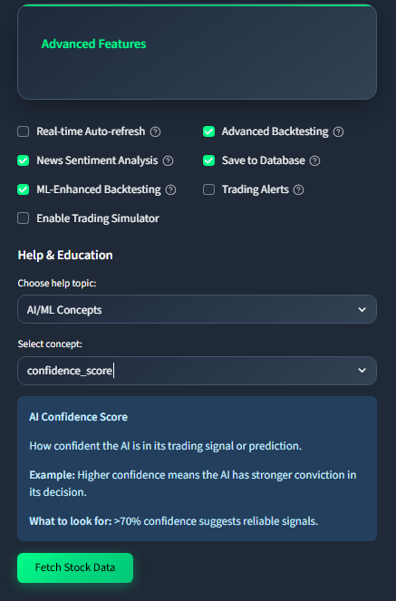

# SUDNAXI - Trading Intelligence Platform

**S**mart **U**nified **D**ecision-making **N**etwork for **A**sset **X**telligence & **I**nsights


> **[Live Demo](https://sudnaxi-trading-intelligence.onrender.com/)** · Real-time market data across 9 global exchanges · ML-driven signal generation · 1,000+ trade backtesting engine



---

## The Problem

Retail traders work with fragmented tools - one platform for charts, another for news, a third for backtesting. Technical indicators are calculated manually, market-moving news is missed, and there is no systematic way to validate strategies before risking capital. The result: slow decisions, scattered data, and no feedback loop for improving trade quality.

## The Solution

SUDNAXI consolidates real-time market intelligence, technical analysis, ML-driven signal generation, news sentiment scoring, and strategy backtesting into a single Streamlit application. One interface, nine markets, zero subscription fees.

---

## Demo

### Dashboard
Track live prices, portfolio metrics, and market overview in a single view.



### Technical Analysis
Professional-grade charting with RSI, MACD, Bollinger Bands, and Moving Average overlays. Configurable across 8 timeframes (1D to 5Y).



### Chart Preview
Interactive Plotly charts with zoom, hover tooltips, and signal overlays for buy/sell indicators.



### News Sentiment Analysis
Real-time news aggregation with NLP-based sentiment scoring to track what is actually moving markets.



### ML Adaptation Engine
Adaptive AI strategies with 30-minute learning cycles that optimize signal generation based on real-time market feedback.



### Backtesting Engine
Run strategy simulations across 1,000+ generated trades with performance metrics, drawdown analysis, and risk-adjusted returns.



### Advanced Features & Help System
Built-in educational tooltips, trading terminology glossary, and contextual help for every feature.



---

## Key Features

**Market Coverage**
- Live data from 9 global exchanges: US, India, UK, Germany, Japan, China, Canada, Australia, Brazil
- 500+ stock symbols with real-time price updates
- Multi-timeframe analysis: 1D, 5D, 1M, 3M, 6M, 1Y, 2Y, 5Y

**Technical Analysis**
- RSI, MACD, Bollinger Bands, SMA/EMA overlays
- Smart signal generation with confidence scoring (-5 to +5)
- Volume and trend analysis with interactive Plotly charts

**Machine Learning**
- Adaptive strategy optimization with 30-minute learning cycles
- Reinforcement learning components for signal enhancement
- Risk-adjusted position sizing based on portfolio volatility

**Backtesting & Simulation**
- Strategy validation engine generating 1,000+ simulated trades
- Paper trading simulator for risk-free strategy testing
- Performance analytics: Sharpe ratio, max drawdown, win rate

**News Intelligence**
- Aggregated news feed with NLP sentiment analysis
- Analyst recommendation tracking with price target analysis
- Market-moving event detection and alerting

---

## Architecture

```
sudnaxi-trading/
├── app.py                          # Main Streamlit application
├── config.py                       # Centralized configuration
├── constants.py                    # Market symbols, exchange mappings
├── start_app.py                    # Production launcher
├── core/                           # Core business logic
├── ml/
│   ├── adaptive_strategy.py        # ML-driven trading strategies
│   └── reinforcement_learning.py   # RL signal optimization
├── utils/
│   ├── data_fetcher.py             # Yahoo Finance API integration
│   ├── chart_generator.py          # Plotly chart rendering
│   ├── news_sentiment.py           # NLP news analysis
│   ├── backtesting_engine.py       # Strategy simulation engine
│   └── enhanced_backtesting.py     # Advanced backtesting analytics
├── database/
│   └── models.py                   # SQLite/PostgreSQL ORM models
├── assets/                         # Screenshots and static assets
├── Dockerfile                      # Container configuration
├── docker-compose.yml              # Multi-service orchestration
└── production_requirements.txt     # Pinned dependencies
```

---

## Tech Stack

| Layer | Technology | Purpose |
|-------|-----------|---------|
| Frontend | Streamlit | Interactive web application |
| Visualization | Plotly | Professional-grade interactive charts |
| Data Processing | Pandas, NumPy | Financial data manipulation |
| Market Data | Yahoo Finance API | Real-time and historical price feeds |
| ML Engine | Scikit-learn, Custom RL | Adaptive strategy optimization |
| Database | SQLite / PostgreSQL | Trade history and user data |
| Deployment | Docker, Render | Containerized cloud deployment |

---

## Getting Started

### Prerequisites
- Python 3.8+
- Internet connection (for live market data)

### Local Setup

```bash
# Clone the repository
git clone https://github.com/MuditNautiyal-21/SUDNAXI-Trading-Intelligence.git
cd SUDNAXI-Trading-Intelligence

# Create virtual environment
python -m venv venv
source venv/bin/activate        # Linux/macOS
venv\Scripts\activate           # Windows

# Install dependencies
pip install -r production_requirements.txt

# Run the application
python start_app.py
```

Open `http://localhost:8501` in your browser.

### Docker

```bash
# Using Docker Compose (recommended)
docker-compose up -d

# Or manual build
docker build -t sudnaxi .
docker run -p 8501:8501 sudnaxi
```

### Environment Variables (Optional)

Create a `.env` file in the root directory:

```
DATABASE_URL=sqlite:///./trading_app.db
OPENAI_API_KEY=your_key_here
NEWS_API_KEY=your_key_here
```

Defaults to SQLite - no additional database setup required.

---

## My Role

Designed and built the entire platform end-to-end as a solo project:

- Architected the modular Python backend with clear separation between data fetching, analysis, ML, and presentation layers
- Built the adaptive ML strategy engine with 30-minute retraining cycles and reinforcement learning signal optimization
- Implemented the backtesting simulation engine capable of generating and evaluating 1,000+ trades per strategy
- Integrated Yahoo Finance API with intelligent caching and rate limiting for 9 global exchanges
- Designed the dark-themed Streamlit UI optimized for extended trading sessions
- Containerized with Docker and deployed to Render for public access

---

## License

MIT License — see [LICENSE](LICENSE) for details.
